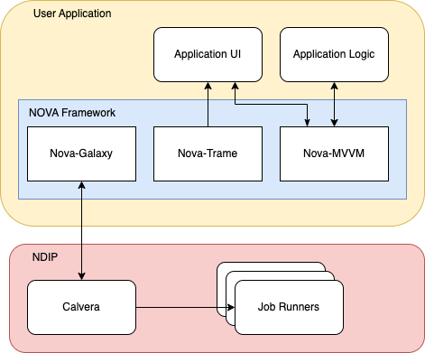

::::::::::::::::::::::::::::::::::::::: objectives

- Understand the purpose of the NOVA tutorial and its goals.
- Explain the roles of NDIP and NOVA in neutron data analysis.
- Identify the core NOVA libraries and their functionalities.
- Describe the high-level architecture of a NOVA application interacting with NDIP.

::::::::::::::::::::::::::::::::::::::::::::::::::

:::::::::::::::::::::::::::::::::::::::: questions

- What is the Neutron Data Interpretation Platform (NDIP)?
- What is NOVA, and how does it simplify NDIP application development?
- What are the key components of NOVA, and what problems do they solve?
- How do NOVA libraries interact with the NDIP platform?
- What will I be able to do after completing this tutorial?

::::::::::::::::::::::::::::::::::::::::::::::::::

# 1. Introduction to NOVA and NDIP

Welcome to the NOVA tutorial! This guide will walk you through the process of building interactive tools for the analysis and visualization of neutron scattering data using the NOVA platform. You will learn how to create a web application that leverages the NOVA libraries to simplify interaction with the Neutron Data Interpretation Platform (NDIP).

## What is NDIP?

NDIP is a workflow management system built on top of the Galaxy platform. It is designed to enable modular scientific workflows for the analysis and interpretation of **neutron scattering data**. NDIP provides a range of services including automated data ingestion, job submission, computational resource management, and visualization and analysis tools. The analysis of neutron scattering data often involves complex, multi-step workflows that include data reduction, correction, analysis algorithms, and visualization. NDIP streamlines these processes by providing a platform to manage and automate these workflows, ensuring reproducibility and efficiency.

## What is NOVA?

NOVA is a framework that aims to simplify the development of applications that interact with NDIP. It consists of three core libraries:

*   **`nova-galaxy`**: This library simplifies interaction with the NDIP platform\'s APIs. It allows developers to easily connect to NDIP, **submit jobs, handle parameters, and monitor job progress.**

*   **`nova-trame`**: This library facilitates the creation of interactive user interfaces using Trame, a powerful Python framework for building web-based UIs and visualizations. `nova-trame` provides a consistent look and feel for NOVA applications by simplifying interactions with Trame components (such as Vuetify).

*   **`nova-mvvm`**: This library simplifies implementation of the Model-View-ViewModel (MVVM) design pattern. By utilizing this library, users can create structured applications that are more testable and easier to maintain.

## NDIP and NOVA Together

To better understand how NOVA works with NDIP, consider this simplified architecture:



In essence, you will build your **User Application** using the **NOVA Libraries**, which in turn will interact with the **NDIP Platform** to perform neutron data analysis tasks.

## What Will You Learn?

In this tutorial, you will learn how to use these three core NOVA libraries to build a web-based user interface that allows you to:

*   Connect to NDIP.
*   Reference job definitions from tool XML files.
*   Set parameters for those tools.
*   Run the tools using the supplied paramters.
*   Monitor the progress of the running tools.
*   Obtain output from the tool when it completes.
*   Create user interfaces to enable access to NDIP tools
*   Add visualizations to the user interface

We\'ll be using example tools as a demonstration for this tutorial, however, the lessons learned here can be applied to a wide variety of neutron scattering data analysis applications. This hands-on tutorial will guide you through each step of the process, empowering you to build your own interactive tools.

## Downloading the tutorial repository

The tutorial is hosted on the ORNL gitlab at [https://code.ornl.gov/ndip/public-packages/nova-carpentry-tutorial](https://code.ornl.gov/ndip/public-packages/nova-carpentry-tutorial). The simplest and recommended way to download the tutorial repository is by using git and the command:
```bash
git clone https://code.ornl.gov/ndip/public-packages/nova-carpentry-tutorial.git
```

It is also possible to download a zipped copy of the repository directly from the repository\'s gitlab web site.

## Code Examples Directory

All of the code examples used in this tutorial are available in the `code` directory of the tutorial repository. These examples are built upon the template application that you will clone in the next episode. The code is organized by episode, with each episode having its own subdirectory (e.g., `code/episode_2`, `code/episode_3`, etc.).

Each episode\'s subdirectory contains a complete, self-contained Python project that can be run independently using Poetry. This allows you to easily explore the code examples, run them, and modify them as you go through the tutorial.

::::::::::::::::::::::::::::::::::::::::: callout

Poetry is a tool for dependency management and packaging in Python. It allows you to declare the libraries your project depends on, and it will manage the installation and updating of those dependencies. Poetry also helps you create reproducible builds by locking the versions of your dependencies. It also makes it easier to publish and share your Python projects.

::::::::::::::::::::::::::::::::::::::::::::::::::

To run the code for a specific episode, navigate to the episode\'s directory in your terminal and use the following commands:

```bash
cd code/episode_X  # Replace X with the episode number
poetry install      # Install dependencies for this episode
poetry run app      # Run the application for this episode
```

This structure ensures that each code example is isolated and runnable, making it easier for you to follow along with the tutorial and experiment with the code.

## References

*   **Nova Documentation**: https://nova-application-development.readthedocs.io/en/latest/
*   **nova-galaxy documentation**: https://nova-application-development.readthedocs.io/projects/nova-galaxy/en/latest/
*   **nova-trame documentation**: https://nova-application-development.readthedocs.io/projects/nova-trame/en/stable/
*   **nova-mvvm documentation**: https://nova-application-development.readthedocs.io/projects/mvvm-lib/en/latest/

:::::::::::::::::::::::::::::::::::::::: keypoints
- NDIP is a workflow management system used for analsyis and interpretation of neutron scattering data.
- NDIP has a range of services and tools to enable the creation of complex workdlows for data analysis.
- NOVA is a set of libraries that provide a framework to simplify the development of interactive applications for NDIP
::::::::::::::::::::::::::::::::::::::::::::::::::