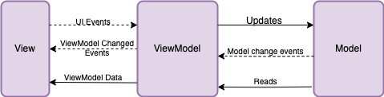

::::::::::::::::::::::::::::::::::::::: objectives

- Define the Model-View-ViewModel (MVVM) design pattern and its benefits.
- Explain the responsibilities of each component in the MVVM pattern (Model, View, ViewModel).
- Describe the role of data binding in MVVM and how it enables reactive UIs.
- Explain the purpose of the `nova-mvvm` library and its key components (`BindingInterface`, `TrameBinding`, `Communicator`, `new_bind`).
- Introduce Pydantic for data modeling and validation within the MVVM pattern.
- Understand how to implement MVVM using `nova-mvvm` and Pydantic in a NOVA application.

::::::::::::::::::::::::::::::::::::::::::::::::::

:::::::::::::::::::::::::::::::::::::::: questions

- What is the Model-View-ViewModel (MVVM) design pattern, and why is it useful for UI development?
- What are the roles and responsibilities of the Model, View, and ViewModel in the MVVM pattern?
- How does data binding work in MVVM, and why is it important?
- How does the `nova-mvvm` library simplify the implementation of the MVVM pattern in NOVA applications?
- What is Pydantic, and how can it be used for data modeling and validation in the context of MVVM?

::::::::::::::::::::::::::::::::::::::::::::::::::

# 4. User Interface Best Practices: The MVVM Design Pattern

In this section, we will introduce the Model-View-ViewModel (MVVM) design pattern, a powerful architectural approach for structuring applications, particularly those with user interfaces. We\'ll explore the core principles of MVVM, the roles of each component, and how the NOVA framework simplifies its implementation, making your code more organized, testable, and maintainable.

## What is a Design Pattern?

Before diving into MVVM, it\'s helpful to understand what a *design pattern* is in software development. A design pattern is a reusable solution to a commonly occurring problem in software design. It\'s not a code snippet you can copy and paste, but rather a template or blueprint for how to structure your code to achieve a specific goal (e.g., separation of concerns, code reusability, testability).

## The Model-View-ViewModel (MVVM) Pattern

MVVM is an architectural design pattern specifically designed for applications with user interfaces (UIs). It aims to separate the UI (the View) from the underlying data and logic (the Model) by introducing an intermediary component called the ViewModel. This separation makes the application more maintainable, testable, and easier to evolve.



The MVVM pattern consists of three core components:
*   **Model:** The Model represents the *data* and the *business logic* of the application. It\'s responsible for:
    *   Data storage (e.g., reading from and writing to a database, a file, or an API).
    *   Data validation (ensuring the data is in a valid state).
    *   Business rules (the logic that governs how the data is manipulated and used).

The Model is agnostic to the UI. It doesn\'t know anything about how the data will be displayed or how the user will interact with it. It simply provides the data and the means to manipulate it.

*   **View:** The View is the *user interface* (UI) of the application. It\'s responsible for:
    *   Displaying data to the user.
    *   Capturing user input (e.g., button clicks, text entered in a field, selections from a dropdown).
    *   Presenting the application\'s visual appearance.

    The View is *passive*. It doesn\'t contain any business logic or data manipulation code. It simply displays the data provided to it and relays user actions to the ViewModel.

    In our NOVA tutorial, the View will be built using Trame and Vuetify components, leveraging the styling and structure provided by `nova-trame`.

*   **ViewModel:** The ViewModel acts as an *intermediary* between the Model and the View. It\'s responsible for:
    *   Preparing data from the Model for display in the View. This might involve formatting the data, combining data from multiple sources, or creating derived data.
    *   Handling user actions from the View. This might involve validating user input, updating the Model, or triggering other actions in the application.
    *   Exposing data and commands to the View through *data binding*.

    The ViewModel knows about the View and the data that the View needs, but it doesn\'t know about the specific UI elements that are used to display the data. It also orchestrates the interaction between the View and the Model.

    *The ViewModel is where we\'ll use `nova-mvvm` to create bindings between the ViewModel and the View, enabling the reactive updates.*

## Why Use MVVM? (Benefits)

The MVVM pattern provides several benefits:

*   **Separation of Concerns:** MVVM clearly separates the UI (View) from the application logic (Model) and the presentation logic (ViewModel). This makes the code more organized and easier to understand.
*   **Testability:** Because the ViewModel is independent of the View, it can be easily unit-tested. You can test the presentation logic without needing to create a UI.
*   **Maintainability:** Changes to the UI are less likely to affect the underlying application logic, and vice versa. This makes the application easier to maintain and evolve over time.
*   **Reusability:** The ViewModel can be reused with different Views, allowing you to create different UIs for the same underlying data and logic.
*   **Team Collaboration:** MVVM facilitates collaboration between developers and UI designers. Developers can focus on the Model and ViewModel, while designers can focus on the View, without interfering with each other\'s work.

## Data Binding: The Heart of MVVM

*Data binding* is a mechanism that allows the View and the ViewModel to automatically synchronize their data. When the data in the ViewModel changes, the View is automatically updated to reflect the changes. Conversely, when the user interacts with the View (e.g., by entering text in a field), the data in the ViewModel is automatically updated.

This data binding is what makes MVVM so powerful and allows for reactive UIs. Instead of manually writing code to update the UI every time the data changes, you simply bind the UI elements to the data in the ViewModel, and the updates happen automatically.

## How NOVA Simplifies MVVM

The NOVA framework provides libraries and tools that simplify the implementation of the MVVM pattern:

*   **`nova-mvvm`**: This library provides a set of classes and functions that make it easier to create bindings between the ViewModel and the View. It handles the low-level details of data synchronization, allowing you to focus on the application logic.
*   **`nova-trame`**: Provides a set of pre-built components and layouts that are designed to work seamlessly with `nova-mvvm`. This simplifies the creation of the View and ensures a consistent look and feel across NOVA applications.
*   **Pydantic:** While not strictly part of the MVVM pattern, Pydantic helps define the structure of your Model and ViewModel, making it easier to validate data and ensure data integrity.

## Introduction to Pydantic for Data Modeling

Pydantic is a Python library that we will use to define data models and enforce data validation in our application. It uses Python type hints to define the structure of your data and automatically validates data against these types at runtime.

Benefits of Pydantic:

*   **Data Validation:** Automatically validates data types and constraints, ensuring data integrity.
*   **Clear Data Structures:**  Defines data models in a clear and readable way using Python type hints.
*   **Serialization and Deserialization:** Easily serializes data to and from standard formats like JSON.
*   **Improved Code Readability:**  Makes code easier to understand and maintain by explicitly defining data models.

## Data Binding with NOVA

The **`nova-mvvm`** library greatly simplifies the data synchronization between the View and Model-View for Trame, PyQt, and Panel. The library provides the classes TrameBinding, PyQtBinding, and PanelBinding to connect UI components to Model-View variables. Here, we'll focus on the TrameBinding but all three function similarly.

### How to use TrameBinding

The initial step is to great a BindingInterface. The BindingInterface serves as the foundational layer for how connections are made between variables in the ViewModel and GUI elements in the View. Once a Trame application has started, the BindingInterface can be created with:

``` python
bindingInterface = TrameBinding(self.server.state) # server is the Trame Server
```

After the bindingInterface has been created, variables must be added to the interface via the interface\'s new_bind method. The `new_bind` method expects the variable to link, and an optional callback method. The callback method is useful if there are actions to be performed after updates to the UI. In the code snippet below, the `model` variable is added to the binding interface. This `new_bind` method returns a `Communicator`. The `Communicator` is an object which manages the binding and will be used to propgate updates.

``` python
# Adding a binding to the Binding Interface
self.config_bind = binding.new_bind(self.model)
```

```python
# Updating the UI connected to a binding.
def update_view(self) -> None:
    self.config_bind.update_in_view(self.model)
```

We\'ve seen how to create a BindingInterface, add a new binding, and how to perform updates. We also need to connect our view component to the Communicator. The Communicator class has a `connect` method. This method accepts a connector object. In the example below, we connect to the `config_bind` communicator object that was created in our ViewModel. We\'re passing in a string as our connector object, but we could pass in a callable object instead.

```python
self.view_model.config_bind.connect("config")
```

Finally, we connect a GUI element to the connector object. The template application uses the *`nova-trame`* library which we\'ll work with in the next episode. For now, just note that InputField is a UI element that is being connected to the binding in our ViewModel

```python
InputField(v_model="config.username")
```

## Implementing MVVM with `nova-mvvm` and Pydantic

Let\'s see how to implement the MVVM pattern using `nova-mvvm` and incorporate Pydantic for data validation.

**1. Adding Fractal to the ViewModel (`src/nova_tutorial/view_models/main.py`):**

*   **Running our Model**:  We start by adding a method to our ViewModel which will run the Fractal tool.

    ```python
    def run_fractal(self) -> None:
        self.model.fractal.run_fractal_tool()
        self.update_view()

    ```
**2. Updating our Fractal Class for pydantaic and MVVM (`src/nova/tutorial/models/fractal.py**

*   **Adding new imports**: We need to add some imports for pydantic and working with base64 encondings to deal with the image.

    ```python
    from base64 import b64encode
    from typing import Literal

    from pydantic import BaseModel, Field
    ```

*   **Update class variables:** Now we'll update fractal_type to support pydantic and add an image variable to store the image. Modify the variable declarations to the following: 

    ```python
    class Fractal(BaseModel):
        fractal_type: Literal["mandelbrot", "julia", "random", "markus"] = Field(default="mandelbrot")
        galaxy_url: str = Field(default_factory=lambda: os.getenv("GALAXY_URL"), description="NDIP Galaxy URL")
        galaxy_key: str = Field(default_factory=lambda: os.getenv("GALAXY_API_KEY"), description="NDIP Galaxy API Key")

        image_data: str = Field(default="", description="Base64 encoded PNG")
    ```

*   **Decode the image data:** Finally, we need to decode the image that we receive as the output from the tool execution. Modify the section where we execute the tool to the following:

    ```python
            output.get_dataset("output").download("tmp.png")

            with open("tmp.png", "rb") as image_file:
                self.image_data = f"data:image/png;base64,{b64encode(image_file.read()).decode()}"
    ```

**3. Creating a FractalTab (`src/nova_tutorial/views/fractal_tab.py`):**

*   **Create a fractal tab**: Create a new file and add the following code:

    ```python
    from trame.widgets import vuetify3 as vuetify

    from nova.trame.view.components import InputField
    from nova_tutorial.app.view_models.main import MainViewModel

    class FractalTab:

        def __init__(self, view_model: MainViewModel) -> None:
            self.view_model = view_model
            self.create_ui()

        def create_ui(self) -> None:
            InputField(v_model="config.fractal.fractal_type")
            vuetify.VBtn(
                "Run Fractal",
                click=self.view_model.run_fractal # calls the run_fractal_tool method
            )
            vuetify.VImg(src=("config.fractal.image_data",), height="400", width="400")
    ```
**4. Modify the tab panel (`src/nova_tutorial/views/tab_panel.py`):**
    Modify the tab panel to add our new Fractal tab

    ```python
        with vuetify.VTabs(v_model=("active_tab", 0), classes="pl-5"):
            vuetify.VTab("Fractal", value=1)  # Add Fractal Tab
            vuetify.VTab("Sample Tab 1", value=2)
            vuetify.VTab("Sample Tab 2", value=3)
    ```

**5. Modify the tab panel content (`src/nova_tutorial/views/tab_content_panel.py`):**
    Add our new Fractal Tab to the tab content panel.

    ```python
        with vuetify.VWindow(v_model="active_tab"):
            with vuetify.VWindowItem(value=1):
                FractalTab(self.view_model)  # Add FractalTab
            with vuetify.VWindowItem(value=2):
            SampleTab1()
            with vuetify.VWindowItem(value=3):
                SampleTab2()
    ```

## Running the application

To run the code, use the following command in the top level of your `nova_tutorial` project:

```bash
poetry run app
```

You should see `Fractal tool finished successfully.` printed to the console, although we have not created a UI yet.

:::::::::::::::::::::::::::::::::::::::  challenge
**Trigger Pydantic Validation Error (Programmatic)**
    *   In `FractalViewModel` in `src/nova_tutorial/view_models/fractal_view_model.py`, modify the `update_fractal_programmatically` function from the previous exercise to use an *invalid* fractal type:
        ```python
        def update_fractal_programmatically(new_type: str):
            self.fractal_type = new_type # Use the setter which includes validation
            print("Attempted to set fractal type programmatically to:", new_type)
            print("Current fractal type (after attempt):", self._fractal_type) # Print value after attempt
            print("Current message:", self._message) # Print message

        update_fractal_programmatically("invalid-fractal-type") # Programmatically update to invalid type
        ```
    *   Run the application (`poetry run app`). Observe the console output. Verify that:
        *   The message "Attempted to set fractal type programmatically to: invalid-fractal-type" is printed.
        *   The "Current fractal type (after attempt):" is still "mandelbrot" indicating the invalid update was rejected.
        *   The "Current message:" now contains a "Validation Error" message from Pydantic.

::::::::::::::::::::::::::::::::::::::::::::::::::

:::::::::::::::::::::::::::::::::::::::  challenge
**Inspect ViewModel State**
    *   In `src/nova_tutorial/view_models/fractal_view_model.py`, add `print` statements within the `FractalViewModel.__init__` method to print the initial values of `self._fractal_type`, `self._job_status`, and `self._message`.
    *   Run the application (`poetry run app`). Observe the output in the console. Verify that the initial values are printed as expected.
    *   Now, modify the `FractalViewModel.__init__` method to change the initial value of `self._message` to "Application starting...". Run the application again and confirm that the printed initial message has changed.

::::::::::::::::::::::::::::::::::::::::::::::::::

:::::::::::::::::::::::::::::::::::::::  challenge
**Programmatic State Update and Binding:**
    *   In `FractalViewModel` in `src/nova_tutorial/view_models/fractal_view_model.py`, after the line `self.fractal_type_bind = binding.new_bind(...)` in `__init__`, add the following lines:
        ```python
        print("Initial fractal type:", self._fractal_type) # Print initial value

        def update_fractal_programmatically(new_type: str):
            self.fractal_type = new_type # Use the setter to trigger validation and updates
            print("Fractal type updated programmatically to:", self._fractal_type)

        update_fractal_programmatically("julia") # Programmatically update fractal_type
        print("Fractal type after programmatic update:", self._fractal_type)
        ```
    *   Run the application (`poetry run app`). Observe the console output. Verify that:
        *   The initial fractal type is printed as "mandelbrot".
        *   The message "Fractal type updated programmatically to: julia" is printed.
        *   The final fractal type (after programmatic update) is printed as "julia".

::::::::::::::::::::::::::::::::::::::::::::::::::

## References

*   **Nova Documentation**: https://nova-application-development.readthedocs.io/en/latest/
*   **nova-galaxy documentation**: https://nova-application-development.readthedocs.io/projects/nova-galaxy/en/latest/
*   **nova-trame documentation**: https://nova-application-development.readthedocs.io/projects/nova-trame/en/stable/
*   **nova-mvvm documentation**: https://nova-application-development.readthedocs.io/projects/mvvm-lib/en/latest/

:::::::::::::::::::::::::::::::::::::::: keypoints
- MVVM stands for Model, View, View-Model.
- MVVM is a design pattern which provides best practices for UI development.
- MVVM helps developers create maintainable, testable, and reusable code.
- The foundation of MVVM is a separation of logic between the UI (view), and the business logic (model) of the application.
- The View-Model component serves as an intermediary between the Model and the View.
- Pydantic is frequently used to validate inputs into our models.
- Bindings are used to synchronize data between the view and view-model.
::::::::::::::::::::::::::::::::::::::::::::::::::
