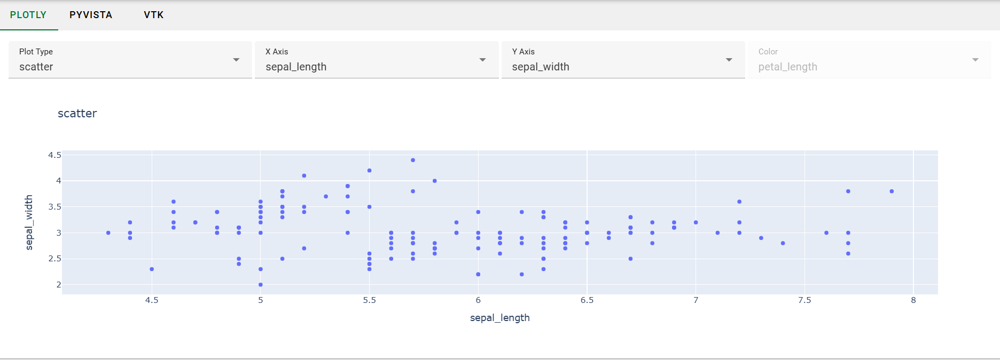
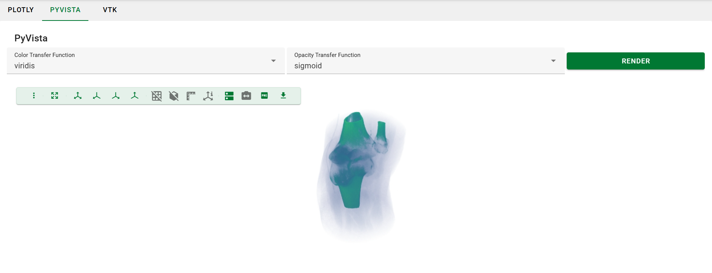
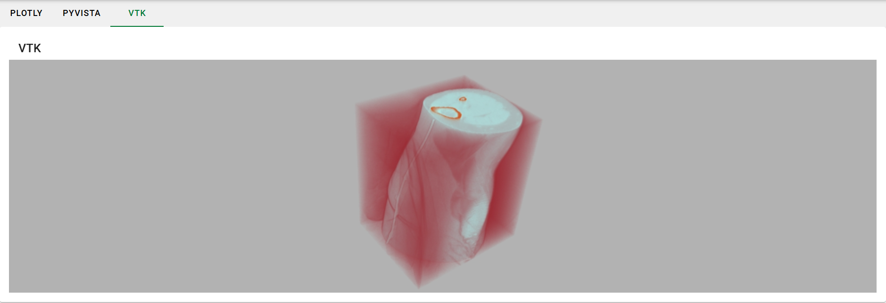

::::::::::::::::::::::::::::::::::::::: objectives

- Describe the purpose of Plotly for interactive 2D charts.
- Explain how to integrate Plotly charts into Trame applications using `trame-plotly`.
- Describe the purpose of PyVista for interactive 3D visualizations.
- Explain how to integrate PyVista visualizations into Trame applications using `trame-vtk`.
- Explain how to work directly with VTK for 3D visualizations within Trame applications.
- Understand the basic boilerplate code required to set up a VTK rendering pipeline in Trame.

::::::::::::::::::::::::::::::::::::::::::::::::::

:::::::::::::::::::::::::::::::::::::::: questions

- How can I create interactive 2D charts in my NOVA application?
- How can I integrate Plotly charts into Trame applications?
- How can I create interactive 3D visualizations in my NOVA application?
- What are the advantages and disadvantages of using PyVista vs. VTK for 3D visualizations?
- How can I integrate PyVista visualizations into Trame applications?
- How can I work directly with VTK for more advanced 3D visualizations in Trame?
- What are the key components of a VTK rendering pipeline?

::::::::::::::::::::::::::::::::::::::::::::::::::

# 7. Advanced Visualizations

In this section, we will look at a selection of the libraries that integrate well with Trame for producing more sophisticated visualizations of your data. Specifically, we will look at Plotly for interactive 2D charts, PyVista for interactive 3D visualizations, and VTK for advanced 3D visualizations.

The complete code for this episode is available in the `code/episode_7` directory. This code defines a Trame application that presents three views (one each for Plotly, PyVista, and VTK) that the user can choose between with a tab widget.

## Setup

Let\'s start by setting up a new application from the template. When answering the `copier` questions, make sure you select "no" for installing Mantid and set up a Trame-based, multi-tab view based on MVVM.

```bash
copier copy https://code.ornl.gov/ndip/project-templates/nova-application-template.git viz_tutorial
```

*   **What is your project name?**

    > Enter `Viz Examples`

*   **What is your Python package name (use Python naming conventions)?**

    > Press enter to accept the default.

*   **Do you want to install Mantid for your project?**

    > Enter `no`

*   ** Are you developing a GUI application using MVVM pattern?**

    > Enter `yes`

*   ** Which library will you use?**

    > Select `Trame`

*   **Do you want a template with multiple tabs?

    > Enter `yes`

*   **Publish to PyPI?**

    > Enter `no`

*   **Publish documentation to readthedocs.io?**

    > Enter `no`

```bash
cd viz_tutorial
poetry install
poetry run app
```

## Plotly (2D)

Trame provides a library called [trame-plotly](https://github.com/Kitware/trame-plotly) for connecting Trame and [Plotly](https://plotly.com/python/). You can install it with:

```bash
poetry add pandas plotly trame-plotly
```

The pandas install is only necessary for loading example data from Plotly, which we'll be doing in this tutorial.

Now, we can create a view that displays a Plotly figure.

**1. `PlotlyView` View Class (`src/viz_examples/views/plotly.py`) (Create):**

*   **Imports**:  Pay special attention to the plotly import. This module contains a Trame widget that will allow us to quickly add a Plotly chart to our view.

```python
"""View for Plotly."""

import plotly.graph_objects as go
from nova.trame.view.components import InputField
from nova.trame.view.layouts import GridLayout, HBoxLayout
from trame.widgets import plotly

from ..view_models.main import MainViewModel
```

*   **Class Definition**:  The view model connections allow us to connect the controls we will define in create_ui() to the server and update the Plotly chart after a control is changed.

```python
class PlotlyView:
    """View class for Plotly."""

    def __init__(self, view_model: MainViewModel) -> None:
        self.view_model = view_model
        self.view_model.plotly_config_bind.connect("plotly_config")
        self.view_model.plotly_figure_bind.connect(self.update_figure)

        self.create_ui()

        self.view_model.update_plotly_figure()
```

*   **Controls**:  These controls will dynamically update the Plotly chart.

```python
    def create_ui(self) -> None:
        with GridLayout(columns=4, classes="mb-2"):
            InputField(v_model="plotly_config.plot_type", items="plotly_config.plot_type_options", type="select")
            InputField(v_model="plotly_config.x_axis", items="plotly_config.axis_options", type="select")
            InputField(v_model="plotly_config.y_axis", items="plotly_config.axis_options", type="select")
            InputField(
                v_model="plotly_config.z_axis",
                disabled=("plotly_config.is_not_heatmap",),
                items="plotly_config.axis_options",
                type="select",
            )
```

*   **Chart Definition**:  Here, we use the imported Trame widget for Plotly to define the chart. This widget includes an `update` method that allows us to change the content after the initial rendering.

```python
        with HBoxLayout(halign="center", height="50vh"):
            self.figure = plotly.Figure()

    def update_figure(self, figure: go.Figure) -> None:
        self.figure.update(figure)
        self.figure.state.flush()  # This is necessary if you call update asynchronously.
```

As with our previous examples, there is a corresponding model.

**2. `PlotlyConfig` Model Class (src/viz_examples/app/models/plotly.py) (Create):**

*   **Imports**:  The graph_objects module is how we will define the content for our chart. The iris module defines an example dataset.

```python
"""Configuration for the Plotly example."""

import plotly.graph_objects as go
from plotly.data import iris
from pydantic import BaseModel, Field, computed_field

IRIS_DATA = iris()
```

*   **Pydantic definition**:  Here we define the controls for our view.

```python
class PlotlyConfig(BaseModel):
    """Configuration class for the Plotly example."""

    axis_options: list[str] = ["sepal_length", "sepal_width", "petal_length", "petal_width"]
    x_axis: str = Field(default="sepal_length", title="X Axis")
    y_axis: str = Field(default="sepal_width", title="Y Axis")
    z_axis: str = Field(default="petal_length", title="Color")
    plot_type: str = Field(default="scatter", title="Plot Type")
    plot_type_options: list[str] = ["heatmap", "scatter"]

    @computed_field  # type: ignore
    @property
    def is_not_heatmap(self) -> bool:
        return self.plot_type != "heatmap"
```

*   **Plotly Figure Setup**:  Finally, we define the Plotly figure based on the user\'s selection. go.Heatmap and go.Scatter define Plotly `traces`, which represent individual components of the figure.

```python
    def get_figure(self) -> go.Figure:
        match self.plot_type:
            case "heatmap":
                plot_data = go.Heatmap(
                    x=IRIS_DATA[self.x_axis].tolist(),
                    y=IRIS_DATA[self.y_axis].tolist(),
                    z=IRIS_DATA[self.z_axis].tolist()
                )
            case "scatter":
                plot_data = go.Scatter(
                    x=IRIS_DATA[self.x_axis].tolist(),
                    y=IRIS_DATA[self.y_axis].tolist(),
                    mode="markers"
                )
            case _:
                raise ValueError(f"Invalid plot type: {self.plot_type}")

        figure = go.Figure(plot_data)
        figure.update_layout(
            title={"text": f"{self.plot_type}"},
            xaxis={"title": {"text": self.x_axis}},
            yaxis={"title": {"text": self.y_axis}},
        )

        return figure
```

*   **Binding the new view and model**:  Now, we need to add `PlotlyView` to our view and bind `PlotlyConfig` to it in the view model.

First, let's add replace the sample tabs from the template with the following:

**3. `src/app/viz_examples/app/views/tab_content_panel.py` (Modify):**

*   **Import `PlotlyView`**

```python
from ..views.plotly import PlotlyView
```

*   **Update `create_ui`:**  We should remove the sample content from the template and add our new view here.

```python
    def create_ui(self) -> None:
        with vuetify.VForm(ref="form") as self.f:
            with vuetify.VContainer(classes="pa-0", fluid=True):
                with vuetify.VCard():
                    with vuetify.VWindow(v_model="active_tab"):
                        with vuetify.VWindowItem(value=1):
                            PlotlyView(self.view_model)
```

And add the corresponding import:

We also need to update the tabs to show an option for the Plotly view.

**4. `src/viz_examples/views/tabs_panel.py` (Modify):**

```python
    def create_ui(self) -> None:
        with vuetify.VTabs(v_model=("active_tab", 0), classes="pl-5"):
            vuetify.VTab("Plotly", value=1)
```

Finally, we'll need to update the view model to bind our new classes.

**5. `src/viz_examples/view_models/main.py` (Modify):**

*   **Import `PlotlyConfig`**

```python
from ..models.plotly import PlotlyConfig
```

*   **Update `__init__`**

```python
    def __init__(self, model: MainModel, binding: BindingInterface):
        self.model = model
        self.plotly_config = PlotlyConfig()

        self.plotly_config_bind = binding.new_bind(
            linked_object=self.plotly_config, callback_after_update=self.update_plotly_figure
        )
        self.plotly_figure_bind = binding.new_bind()
```

*   **Add callback method**

```python
    def update_plotly_figure(self, _: Any = None) -> None:
        self.plotly_config_bind.update_in_view(self.plotly_config)
        self.plotly_figure_bind.update_in_view(self.plotly_config.get_figure())
```

Now, if you run the application you should see the following in the Plotly tab:



## PyVista (3D)

One of Trame\'s core features is that it has direct integration with VTK for building 3D visualizations. Learning VTK from scratch is non-trivial, however, so we recommend that you work with PyVista. PyVista serves as a more developer-friendly wrapper around VTK, allowing you to build your visualizations with a simpler, more intuitive API. To get started, you will need to install the Python package.

```bash
poetry add pyvista trame-vtk
```

PyVista contains built-in Trame support, but we still need to install the Trame widget for VTK that PyVista will use internally.

Now we can set up our view.

**6. `PyVistaView` View Class (`src/viz_examples/views/pyvista.py`):**

*   **Imports:**  `plotter_ui` contains the Trame widget for PyVista.

```python
"""View for the 3d plot using PyVista."""

from typing import Any, Optional

import pyvista as pv
from nova.trame.view.components import InputField
from nova.trame.view.layouts import GridLayout, HBoxLayout
from pyvista.trame.ui import plotter_ui
from trame.widgets import vuetify3 as vuetify

from ..view_models.main import MainViewModel
```

*   **Class Definition:**  The `Plotter` object is PyVista\'s main entry point. It will allow you to add meshes and volumes with the properties you\'ve specified.

```python
class PyVistaView:
    """View class for the 3d plot using PyVista."""

    def __init__(self, view_model: MainViewModel) -> None:
        self.view_model = view_model
        self.view_model.pyvista_config_bind.connect("pyvista_config")

        self.plotter: Optional[pv.Plotter] = None

        self.create_plotter()
        self.create_ui()

    def create_plotter(self) -> None:
        self.plotter = pv.Plotter(off_screen=True)
```

*   **View Definition:**  Now, we can use `plotter_ui` to create a view into which our rendering will go.

```python
    def create_ui(self) -> None:
        vuetify.VCardTitle("PyVista")
        with GridLayout(columns=5, classes="mb-2", valign="center"):
            InputField(
                v_model="pyvista_config.colormap", column_span=2, items="pyvista_config.colormap_options", type="select"
            )
            InputField(
                v_model="pyvista_config.opacity", column_span=2, items="pyvista_config.opacity_options", type="select"
            )
            vuetify.VBtn("Render", click=self.update)
        with HBoxLayout(halign="center", height="50vh"):
            plotter_ui(self.plotter)

    def update(self, _: Any = None) -> None:
        if self.plotter:
            self.view_model.update_pyvista_volume(self.plotter)
```

**7. `PyVistaConfig` Model Class (`src/viz_examples/models/pyvista.py`):**

*   **Imports:**  `download_knee_full` yields a 3D dataset that is suitable for volume rendering. You can find more datasets in PyVista\'s [Dataset Gallery](https://docs.pyvista.org/api/examples/dataset_gallery).

```python
"""Configuration for the PyVista example."""

from pydantic import BaseModel, Field
from pyvista import Plotter, examples

KNEE_DATA = examples.download_knee_full()
```

*   **Pydantic Configuration:**  The `Fields` defined here will be passed to [`Plotter.add_volume`](https://docs.pyvista.org/api/plotting/_autosummary/pyvista.plotter.add_volume).

```python
class PyVistaConfig(BaseModel):
    """Configuration class for the PyVista example."""

    colormap_options: list[str] = ["viridis", "autumn", "coolwarm", "twilight", "jet"]
    opacity_options: list[str] = ["linear", "sigmoid"]
    colormap: str = Field(default="viridis", title="Color Transfer Function")
    opacity: str = Field(default="linear", title="Opacity Transfer Function")
```

*   **Rendering:**  `add_volume` will return an actor. In practice, you may get better performance by manipulating that actor instead of doing a full re-render.

```python
    def render(self, plotter: Plotter) -> None:
        # If re-rendering the volume on changes isn't acceptable, then you may need to switch to using VTK directly due
        # limitations of the PyVista volume rendering engine.
        plotter.clear()
        plotter.add_volume(KNEE_DATA, cmap=self.colormap, opacity=self.opacity, show_scalar_bar=False)

        plotter.render()
        plotter.view_isometric()
```

::::::::::::::::::::::::::: callout

PyVista\'s volume rendering engine isn\'t currently suitable for large data. If you find yourself running into performance issues, then you should likely switch over to using VTK directly.

:::::::::::::::::::::::::::::::::::

*   **Binding the new view and model**:  Now, we need to add `PyVistaView` to our view and bind `PyVistaConfig` to it in the view model.

This is very similar to the Plotly setup.

**8. `src/viz_examples/views/tab_content_panel.py` (Modify):**

*   **Import `PyVistaView`**

```python
from ..views.pyvista import PyVistaView
```

*   **Update `create_ui`**

```python
    def create_ui(self) -> None:
        with vuetify.VForm(ref="form") as self.f:
            with vuetify.VContainer(classes="pa-0", fluid=True):
                with vuetify.VCard():
                    with vuetify.VWindow(v_model="active_tab"):
                        with vuetify.VWindowItem(value=1):
                            PlotlyView(self.view_model)
                        with vuetify.VWindowItem(value=2):
                            PyVistaView(self.view_model)
```

**9. `src/viz_examples/views/tabs_panel.py` (Modify):**

```python
    def create_ui(self) -> None:
        with vuetify.VTabs(v_model=("active_tab", 0), classes="pl-5"):
            vuetify.VTab("Plotly", value=1)
            vuetify.VTab("PyVista", value=2)
```

**10. `src/viz_examples/view_models/main.py` (Modify):**

*   **Import `PyVistaConfig`**

```python
from pyvista import Plotter  # just for typing
from ..models.pyvista import PyVistaConfig
```

*   **Update `__init__`**

```python
    def __init__(self, model: MainModel, binding: BindingInterface):
        self.model = model
        self.plotly_config = PlotlyConfig()
        self.pyvista_config = PyVistaConfig()

        self.plotly_config_bind = binding.new_bind(
            linked_object=self.plotly_config, callback_after_update=self.update_plotly_figure
        )
        self.plotly_figure_bind = binding.new_bind()
        self.pyvista_config_bind = binding.new_bind(linked_object=self.pyvista_config)
```

*   **Add callback method:**  This method is called directly from the view due to the need to reference the Plotter object that is created in the view.

```python
    def update_pyvista_volume(self, plotter: Plotter) -> None:
        self.pyvista_config.render(plotter)
```

Now, if you run the application you should see the following in the PyVista tab:



## VTK (3D)

If you have prior experience with VTK then you may prefer to work with it directly. You can get started with it by installing the Python VTK bindings and the Trame widget for VTK.

```bash
poetry add trame-vtk vtk==9.3.1
```

::::::::::::::::::::::::: callout
PyVista isn't compatible with VTK 9.4, yet. If you are not using PyVista, there is no need to specify the VTK version like this.
:::::::::::::::::::::::::::::::::

Once more, let's setup a view and model.

**11. `VTKView` View Class (`src/viz_examples/views/vtk.py`):**

*   **Imports:**  The `vtkRenderingVolumeOpenGL2` import is necessary despite being unreferenced.

```python
"""View for the 3d plot using PyVista."""

import vtkmodules.vtkRenderingVolumeOpenGL2  # noqa
from nova.trame.view.layouts import HBoxLayout
from trame.widgets import vtk as vtkw
from trame.widgets import vuetify3 as vuetify
from vtkmodules.vtkRenderingCore import vtkRenderer, vtkRenderWindow, vtkRenderWindowInteractor, vtkVolume

from ..view_models.main import MainViewModel
```

*   **Initialization:**  Here we define the boiler plate for the interactive VTK window. As with PyVista, setting off-screen rendering to on is necessary when working with Trame.

```python
class VTKView:
    """View class for the 3d plot using PyVista."""

    def __init__(self, view_model: MainViewModel) -> None:
        self.view_model = view_model

        self.create_vtk()
        self.create_ui()

        self.render()

    def create_vtk(self) -> None:
        self.renderer = vtkRenderer()
        self.renderer.SetBackground(0.7, 0.7, 0.7)

        self.render_window = vtkRenderWindow()
        self.render_window.AddRenderer(self.renderer)
        self.render_window.OffScreenRenderingOn()

        self.render_window_interactor = vtkRenderWindowInteractor()
        self.render_window_interactor.SetRenderWindow(self.render_window)
        self.render_window_interactor.GetInteractorStyle().SetCurrentStyleToTrackballCamera()
        self.render_window_interactor.Initialize()  # Ensure interactor is initialized
```

*   **View Definition:**  Now, we setup the VTK window and add our volume rendering to it. By using `VTKRemoteView`, we are instructing VTK to perform server-side rendering.

```python
    def create_ui(self) -> None:
        vuetify.VCardTitle("VTK")

        with HBoxLayout(halign="center", height="50vh"):
            self.view = vtkw.VtkRemoteView(self.render_window, interactive_ratio=1)

    def render(self) -> None:
        volume = self.view_model.get_vtk_volume()

        self.renderer.Clear()
        self.renderer.AddVolume(volume)
        self.render_window.Render()
```

**12. `VTKConfig` Model Class (`src/viz_examples/models/vtk.py`):**

*   **Imports:**  We are only using PyVista to get an example dataset. There are two references to it as we use `KNEE_DATA` to compute min/max bounds for the data and `KNEE_DATAFILE` to pass the data file into a VTK reader. The FixedPointVolumeRayCastMapper is CPU-based, but other mappers are available if you need GPU support.

```python
"""Configuration for the VTK example."""

import numpy as np
from pyvista import examples
from vtk import vtkSLCReader
from vtkmodules.vtkCommonDataModel import vtkPiecewiseFunction
from vtkmodules.vtkRenderingCore import vtkColorTransferFunction, vtkVolume, vtkVolumeProperty
from vtkmodules.vtkRenderingVolume import vtkFixedPointVolumeRayCastMapper

KNEE_DATA = examples.download_knee_full()
KNEE_DATAFILE = examples.download_knee_full(load=False)
```

*   **VTK Pipeline Setup:**  The dataset is stored in .slc format, so we can use a built-in VTK reader to load it into a pipeline. From there, we setup the volume. A lookup table is used to define the color transfer function, and a piecewise function is used to define the opacity transfer function.

```python
class VTKConfig:
    """Configuration class for the VTK example."""

    max: float = KNEE_DATA.get_data_range()[1]
    min: float = KNEE_DATA.get_data_range()[0]

    def __init__(self) -> None:
        reader = vtkSLCReader()
        reader.SetFileName(KNEE_DATAFILE)

        mapper = vtkFixedPointVolumeRayCastMapper()
        mapper.SetInputConnection(reader.GetOutputPort())

        lut = self.init_lut()
        pwf = self.init_pwf()
        volume_props = vtkVolumeProperty()
        volume_props.SetColor(lut)
        volume_props.SetScalarOpacity(pwf)
        volume_props.SetShade(0)
        volume_props.SetInterpolationTypeToLinear()

        self.volume = vtkVolume()
        self.volume.SetMapper(mapper)
        self.volume.SetProperty(volume_props)
        self.volume.SetVisibility(1)

    def get_volume(self) -> vtkVolume:
        return self.volume
```

*   **Defining the colormap and opacity transfer functions:**  A full discussion of the colormap would be out-of-scope for the tutorial, but please copy/paste this method into the class to have things work.

```python
    def init_lut(self) -> vtkColorTransferFunction:
        # This method defines the "Fast" colormap.
        # See https://www.kitware.com/new-default-colormap-and-background-in-next-paraview-release/

        lut = vtkColorTransferFunction()

        lut.SetColorSpaceToRGB()
        lut.SetNanColor([0.0, 1.0, 0.0])

        srgb = np.array(
            [
                0,
                0.05639999999999999,
                0.05639999999999999,
                0.47,
                0.17159223942480895,
                0.24300000000000013,
                0.4603500000000004,
                0.81,
                0.2984914818394138,
                0.3568143826543521,
                0.7450246485363142,
                0.954367702893722,
                0.4321287371255907,
                0.6882,
                0.93,
                0.9179099999999999,
                0.5,
                0.8994959551205902,
                0.944646394975174,
                0.7686567142818399,
                0.5882260353170073,
                0.957107977357604,
                0.8338185108985666,
                0.5089156299842102,
                0.7061412605695164,
                0.9275207599610714,
                0.6214389091739178,
                0.31535705838676426,
                0.8476395308725272,
                0.8,
                0.3520000000000001,
                0.15999999999999998,
                1,
                0.59,
                0.07670000000000013,
                0.11947499999999994,
            ]
        )

        for arr in np.split(srgb, len(srgb) / 4):
            lut.AddRGBPoint(arr[0], arr[1], arr[2], arr[3])

        prev_min, prev_max = lut.GetRange()
        prev_delta = prev_max - prev_min
        node = [0.0, 0.0, 0.0, 0.0, 0.0, 0.0]
        next_delta = self.max - self.min
        for i in range(lut.GetSize()):
            lut.GetNodeValue(i, node)
            node[0] = next_delta * (node[0] - prev_min) / prev_delta + self.min
            lut.SetNodeValue(i, node)

        return lut

    def init_pwf(self) -> vtkPiecewiseFunction:
        pwf = vtkPiecewiseFunction()

        pwf.RemoveAllPoints()
        pwf.AddPoint(self.min, 0)
        pwf.AddPoint(self.max, 0.7)

        return pwf
```

*   **Binding the new view and model**:  Now, we need to add `VTKView` to our view and bind `VTKConfig` to it in the view model.

This is very similar to the Plotly and PyVista setup.

**13. `src/viz_examples/views/tab_content_panel.py` (Modify):**

*   **Import `VTKView`**

```python
from ..views.vtk import VTKView
```

*   **Update `create_ui`**

```python
    def create_ui(self) -> None:
        with vuetify.VForm(ref="form") as self.f:
            with vuetify.VContainer(classes="pa-0", fluid=True):
                with vuetify.VCard():
                    with vuetify.VWindow(v_model="active_tab"):
                        with vuetify.VWindowItem(value=1):
                            PlotlyView(self.view_model)
                        with vuetify.VWindowItem(value=2):
                            PyVistaView(self.view_model)
                        with vuetify.VWindowItem(value=3):
                            VTKView(self.view_model)
```

**14. `src/viz_examples/views/tabs_panel.py` (Modify):**

```python
    def create_ui(self) -> None:
        with vuetify.VTabs(v_model=("active_tab", 0), classes="pl-5"):
            vuetify.VTab("Plotly", value=1)
            vuetify.VTab("PyVista", value=2)
            vuetify.VTab("VTK", value=3)
```

**15. `src/viz_examples/view_models/main.py` (Modify):**

*   **Import `VTKConfig`**

```python
from vtkmodules.vtkRenderingCore import vtkVolume  # just for typing
from ..models.vtk import VTKConfig
```

*   **Update `__init__`**

```python
    def __init__(self, model: MainModel, binding: BindingInterface):
        self.model = model
        self.plotly_config = PlotlyConfig()
        self.pyvista_config = PyVistaConfig()
        self.vtk_config = VTKConfig()

        self.plotly_config_bind = binding.new_bind(
            linked_object=self.plotly_config, callback_after_update=self.update_plotly_figure
        )
        self.plotly_figure_bind = binding.new_bind()
        self.pyvista_config_bind = binding.new_bind(linked_object=self.pyvista_config)
        # We didn't add any controls for the VTK rendering, so there's no need to create a data binding here.
```

*   **Add method for retrieving the volume:**  This allows us to pass the volume to the vtkRenderer in the view.

```python
    def get_vtk_volume(self) -> vtkVolume:
        return self.vtk_config.get_volume()
```

Now, if you run the application you should see the following in the VTK tab:



:::::::::::::::::::::::::::::::::::::::  challenge
**Plotly Box Plot**
Add a box plot to the available plot types. Hint: you shouldn\'t need to change anything in the view class to do this.
::::::::::::::::::::::::::::::::::::::::::::::::::

:::::::::::::::::::::::::::::::::::::::  challenge
**PyVista clim Control**
Add control(s) to the UI to control the `clim` argument for the `add_volume` method.
::::::::::::::::::::::::::::::::::::::::::::::::::

:::::::::::::::::::::::::::::::::::::::  challenge
**Investigate the lookup table and piecewise function**
We didn\'t look at `VTKConfig.init_lut` or `VTKConfig.init_pwf` during the tutorial. Read through these methods and then trys manipulating the opacity of the rendering.
::::::::::::::::::::::::::::::::::::::::::::::::::

## References

*   **Plotly Documentation**: https://plotly.com/python/
*   **Trame/Plotly Integration Repository**: https://github.com/Kitware/trame-plotly
*   **PyVista Documentation**: https://docs.pyvista.org/
*   **Trame/PyVista Integration Tutorial**: https://tutorial.pyvista.org/tutorial/09_trame/index.html
*   **VTK Python Documentation**: https://docs.vtk.org/en/latest/api/python.html
*   **Trame Tutorial**: https://kitware.github.io/trame/guide/tutorial/
*   **Calvera documentation**: https://calvera-test.ornl.gov/docs/

:::::::::::::::::::::::::::::::::::::::: keypoints
- Trame integrates well with Plotly for building 2D charts.
- Trame integrates well with PyVista and VTK for building 3D visualizations.
- PyVista provides a simpler API compared to VTK at the cost of performance.
::::::::::::::::::::::::::::::::::::::::::::::::::
